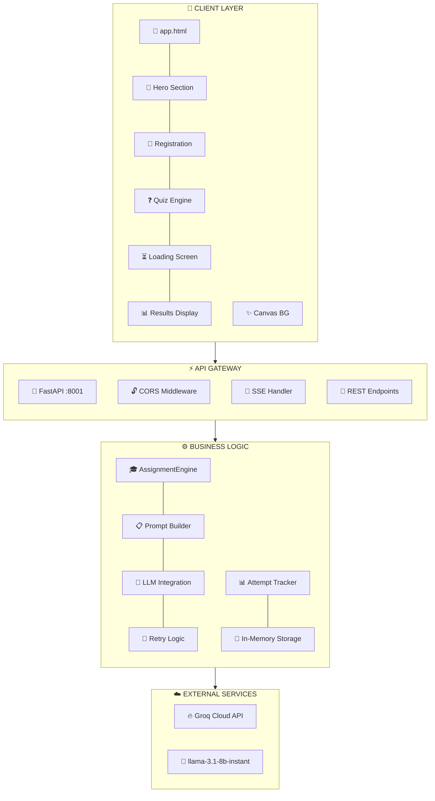
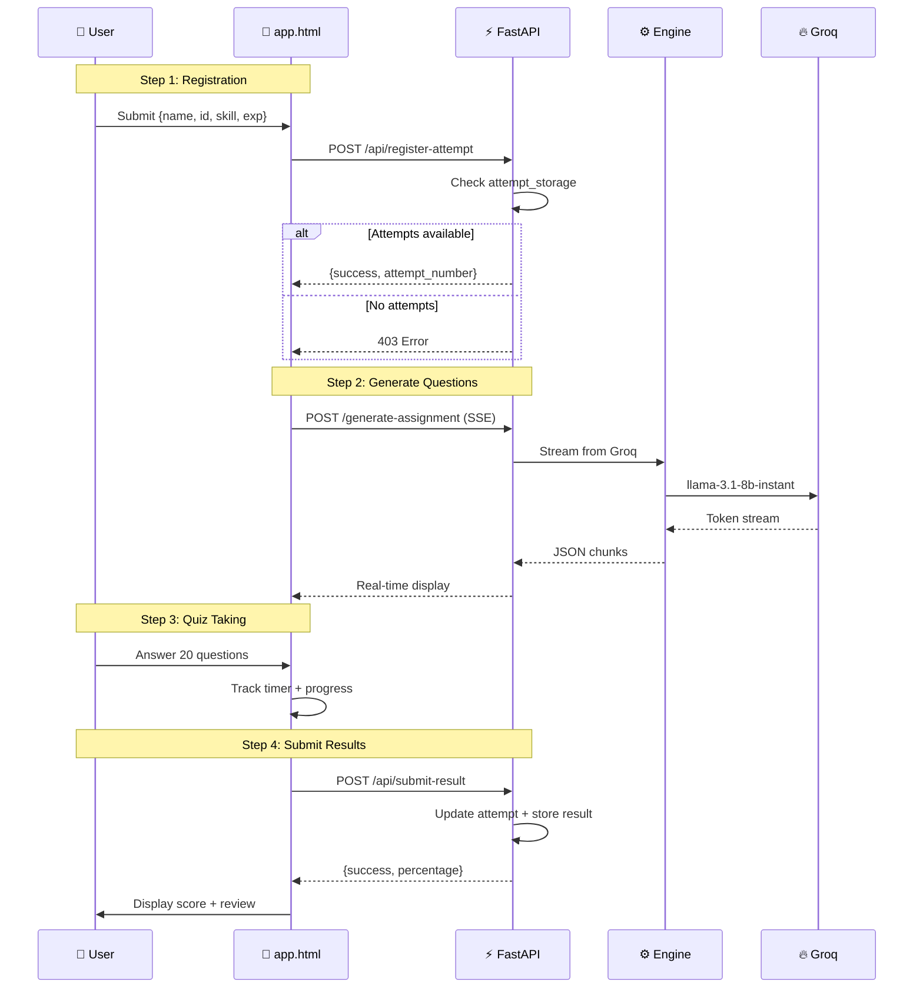

# Skill Achiver - AI-Powered Skill Assessment Platform

<p align="center">
  
  
  
  
</p>

A production-ready AI-powered skill assessment platform that generates challenging technical exams using LLM technology.

---

## Animated Architecture



---

## Data Flow Animation

```
╔══════════════════════════════════════════════════════════════════════╗
║                     📊 DATA FLOW SEQUENCE                            ║
╠══════════════════════════════════════════════════════════════════════╣
║                                                                      ║
║   Step 1: User Registration                                         ║
║   ┌─────────────┐                                                  ║
║   │ { name, id, │ ──→ Validate ──→ Check Attempts ──→ Register    ║
║   │   skill,    │                                                  ║
║   │  experience }                                                  ║
║   └─────────────┘                                                  ║
║           │                                                        ║
║           ▼                                                        ║
║   Step 2: Question Generation                                       ║
║   ┌─────────────┐                                                  ║
║   │  Skills +   │ ──→ Build Prompt ──→ Groq LLM ──→ Parse JSON     ║
║   │ Exp Level   │         (FAANG L8)      (Streaming)              ║
║   └─────────────┘                                                  ║
║           │                                                        ║
║           ▼                                                        ║
║   Step 3: Quiz Taking                                               ║
║   ┌─────────────┐                                                  ║
║   │  Questions │ ──→ Timer ──→ User Answers ──→ Progress Track    ║
║   │    (20)    │        (section-based)                           ║
║   └─────────────┘                                                  ║
║           │                                                        ║
║           ▼                                                        ║
║   Step 4: Results Submission                                        ║
║   ┌─────────────┐                                                  ║
║   │ { score,   │ ──→ Calculate ──→ Store Result ──→ Display      ║
║   │  answers,  │        Percentage                                  ║
║   │  time }    │                                                  ║
║   └─────────────┘                                                  ║
║                                                                      ║
╚══════════════════════════════════════════════════════════════════════╝
```

---

## Component Animation

```
┌────────────────────────────────────────────────────────────────────────────┐
│                        🎮 COMPONENT BREAKDOWN                           │
├────────────────────────────────────────────────────────────────────────────┤
│                                                                            │
│  ┌─▓▓▓▓▓▓▓▓▓▓▓▓▓▓▓▓▓▓▓▓▓▓▓▓▓▓▓▓▓▓▓▓▓▓▓▓▓▓▓▓▓▓▓▓▓▓▓▓▓▓┐   │
│  │                    FRONTEND (app.html)                         │   │
│  ├────────────────────────────────────────────────────────────────┤   │
│  │  🟣 Hero Section     → Animated landing, floating cards       │   │
│  │  🔵 Registration     → Skill autocomplete (50+ skills)       │   │
│  │  🟢 Quiz Engine      → Timed questions, section tracking      │   │
│  │  🟡 Loading Screen   → Animated spinner + real-time status      │   │
│  │  🔴 Results          → Score breakdown, question review         │   │
│  │  ⭐ Canvas BG        → Stars + Aurora + Shooting Stars         │   │
│  └──────────────────────────────────────────────────────────────────┘   │
│                                                                            │
│  ┌─▓▓▓▓▓▓▓▓▓▓▓▓▓▓▓▓▓▓▓▓▓▓▓▓▓▓▓▓▓▓▓▓▓▓▓▓▓▓▓▓▓▓▓▓▓▓▓▓▓┐   │
│  │                     BACKEND (main.py)                          │   │
│  ├────────────────────────────────────────────────────────────────┤   │
│  │  🔗 GET  /app              → Serve HTML frontend                │   │
│  │  🔗 GET  /api/health      → Health check v2.0.0                │   │
│  │  🔗 POST /generate-assignment → SSE question stream           │   │
│  │  🔗 POST /api/check-attempts → Remaining attempts             │   │
│  │  🔗 POST /api/register-attempt → Register new attempt        │   │
│  │  🔗 POST /api/submit-result  → Submit quiz results           │   │
│  │  🔗 GET  /api/results/{id}  → Get student results            │   │
│  └──────────────────────────────────────────────────────────────────┘   │
│                                                                            │
│  ┌─▓▓▓▓▓▓▓▓▓▓▓▓▓▓▓▓▓▓▓▓▓▓▓▓▓▓▓▓▓▓▓▓▓▓▓▓▓▓▓▓▓▓▓▓▓▓▓▓▓┐   │
│  │               ASSIGNMENT ENGINE (assignment_engine.py)          │   │
│  ├────────────────────────────────────────────────────────────────┤   │
│  │  ⚙️ AssignmentGenerator                                        │   │
│  │      ├── 📋 _build_prompt()     → FAANG L8 level prompt         │   │
│  │      ├── 🤖 generate_stream()  → LLM streaming with retry     │   │
│  │      └── 💰 Cost estimation     → INR conversion               │   │
│  │                                                                   │   │
│  │  📊 Attempt Tracker                                            │   │
│  │      ├── 🗂️  attempt_storage     → defaultdict(list)           │   │
│  │      ├── 💾 result_storage      → Results per skill           │   │
│  │      ├── 🔒 results_lock        → Thread-safe locking         │   │
│  │      └── ⏱️  MAX_ATTEMPTS = 2    → Per skill limit           │   │
│  └──────────────────────────────────────────────────────────────────┘   │
│                                                                            │
└────────────────────────────────────────────────────────────────────────────┘
```

---

## API Flow Animation



---

## Question Difficulty Progression

```
╔���══════════════════════════════════════════════════════════════════════╗
║              🎯 QUESTION DIFFICULTY PROGRESSION                          ║
╠═══════════════════════════════════════════════════════════════════════╣
║                                                                        ║
║   Q1-10  ████████████  Advanced Edge-Case                               ║
║          │                                                             ║
║          ├── Single/Multi-Concept Questions                             ║
║          ├── Deep dive: subtle behaviors, race conditions                 ║
║          ├── Observability blind spots                                 ║
║          └── Focus: foundational mastery + high-stakes twists        ║
║                                                                        ║
║   Q11-16 ████████████  Multi-Concept Traps                           ║
║          │                                                             ║
║          ├── Combine 3-4 domains                                      ║
║          ├── Caching + retry + idempotency                            ║
║          ├── Conflicting goals + scale-induced edge cases           ║
║          └── Trade-offs exposing shallow understanding               ║
║                                                                        ║
║   Q17-20 ████████████  The Gauntlet ⏱️                                ║
║          │                                                             ║
║          ├── 6-8 line production incident                            ║
║          ├── Metrics: p99 latency, error rate, throughput              ���
║          ├── Root cause analysis / optimal mitigation                  ║
║          └── FAANG war-story level scenarios                          ║
║                                                                        ║
║   ━━━━━━━━━━━━━━━━━━━━━━━━━━━━━━━━━━━━━━━━━━━━━━━━━━━━━━━━━━━━━━━━━━   ║
║   Target Pass Rate: 5-10%  │  Max Attempts: 2  │  Total: 20 Qs       ║
║                                                                        ║
╚═══════════════════════════════════════════════════════════════════════╝
```

---

## Section Timing Animation

```
┌────────────────────────────────────────────────────────────────────────┐
│                    ⏱️  SECTION TIMING                                    │
├────────────────────────────────────────────────────────────────────────┤
│                                                                         │
│   Section 1: ████████████  Questions 1-10     [██████████████] 15 min   │
│   ▓▓▓▓▓▓▓▓▓▓▓▓▓▓▓▓▓▓▓▓▓▓▓▓▓▓▓▓▓▓▓▓▓▓▓▓▓▓▓▓▓▓▓▓▓▓▓▓▓▓▓▓▓▓▓▓▓▓▓▓▓▓   │
│                                                                         │
│   Section 2: ████████████  Questions 11-15   [████████████████████] 20 min│
│   ▓▓▓▓▓▓▓▓▓▓▓▓▓▓▓▓▓▓▓▓▓▓▓▓▓▓▓▓▓▓▓▓▓▓▓▓▓▓▓▓▓▓▓▓▓▓▓▓▓▓▓▓▓▓▓▓▓▓▓▓▓▓   │
│                                                                         │
│   Section 3: ████████████  Questions 16-20   [████████████████████████] 25 min│
│   ▓▓▓▓▓▓▓▓▓▓▓▓▓▓▓▓▓▓▓▓▓▓▓▓▓▓▓▓▓▓▓▓▓▓▓▓▓▓▓▓▓▓▓▓▓▓▓▓▓▓▓▓▓▓▓▓▓▓▓▓▓▓   │
│                                                                         │
│   Total: 60 minutes max                                                 │
│                                                                         │
└────────────────────────────────────────────────────────────────────────┘
```

---

## Cost Estimation Flow

```
╔═══════════════════════════════════════════════════════════════════════════╗
║                    💰 COST ESTIMATION                                  ║
╠═══════════════════════════════════════════════════════════════════════════╣
║                                                                        ║
║   Input Prompt        → Token Calculation        → Cost                      ║
║   ┌─────────┐       ┌─────────────┐          ┌��─────────┐              ║
║   │  ~5000 │  ÷    │   3.8       │  ×  $0.05 │ $0.065   │  per 1M    ║
║   │ chars  │       │ char/token  │  ÷ 1M    │ tokens   │             ║
║   └─────────┘       └─────────────┘          └──────────┘              ║
║                                                                        ║
║   LLM Output       → Token Calculation        → Cost                      ║
║   ┌─────────┐       ┌─────────────┐          ┌──────────┐              ║
║   │ ~12000 │  ÷    │   3.8       │  ×  $0.08 │ $0.25    │  per 1M    ║
║   │ chars  │       │ char/token  │  ÷ 1M    │ tokens   │             ║
║   └─────────┘       └─────────────┘          └──────────┘              ║
║                                                                        ║
║   ━━━━━━━━━━━━━━━━━━━━━━━━━━━━━━━━━━━━━━━━━━━━━━━━━━━━━━━━━━━━━━━━━━         ║
║   Total: ~$0.32 per quiz → ~₹27 INR → Groq's speed: ~15 seconds        ║
║                                                                        ║
╚═══════════════════════════════════════════════════════════════════════════╝
```

---

## Retry Mechanism Animation

```
┌─────────────────────────────────────────────────────────────────────────────┐
│                    🔄 RETRY LOGIC FLOW                                  │
├─────────────────────────────────────────────────────────────────────────────┤
│                                                                      │
│   Attempt 1 ──┐                                                      │
│   ┌───────────┴───────────┐                                           │
│   │                     │                                           │
│   ▼                     │                                           │
│   ┌─────────────┐        │                                           │
│   │  Request  │        │                                           │
│   │  to Groq  │───────┼──────┐                                    │
│   └─────────────┘       │      │                                    │
│        │              │      │                                    │
│   ┌────┴────┐      │      │ Rate Limit?                              │
│   │ Success │──────┼──────┼──────┐                                   │
│   └─────────┘      │      │     │                                   │
│                    │      │     ▼                                   │
│               ┌────┴────┐  ┌─────────────┐                          │
│               │ 200 OK  │  │  429 Error│                          │
│               └─────────┘  └─────────────┘                          │
│                              │                                      │
│                              ▼                                      │
│                      ┌─────────────┐                               │
│                      │ Retry #2   │────┐                            │
│                      │ wait 2-10s│   │                              │
│                      └─────────────┘   │                            │
│                                   │   │                            │
│                             ┌─────┴───┘                           │
│                             ▼                                      │
│                      ┌─────────────┐                               │
│                      │ Max: 2     │                              │
│                      │ attempts   │                              │
│                      └─────────────┘                              │
│                             │                                      │
│                  ┌─────────┴─────────┐                            │
│                  ▼                 ▼                             │
│            ┌──────────┐     ┌──────────────┐                   │
│            │ Success  │     │ Failed +    │                   │
│            │ (stream) │     │ Error JSON │                   │
│            └──────────┘     └──────────────┘                   │
│                                                               │
└───────────────────────────────────────────────────────────────┘
```

---

## Storage Architecture

```
┌────────────────────────────────────────────────────────────────────────────┐
│                    💾 IN-MEMORY STORAGE                                    │
├────────────────────────────────────────────────────────────────────────────┤
│                                                                         │
│   attempt_storage (defaultdict)                                            │
│   ┌────────────────────────────────────────────────────────────────────┐   │
│   │ "user123:aws" → [                                               │   │
│   │   {                                                           │   │
│   │     "attempt_number": 1,                                         │   │
│   │     "timestamp": "2026-04-03T12:30:00",                        │   │
│   │     "status": "completed"                                         │   │
│   │   },                                                            │   │
│   │   {                                                            │   │
│   │     "attempt_number": 2,                                         │   │
│   │     "timestamp": "2026-04-03T14:00:00",                        │   │
│   │     "status": "in_progress"                                      │   │
��   ��   }                                                            │   │
│   │ ]                                                               │   │
│   └────────────────────────────────────────────────────────────────────┘   │
│                                                                         │
│   result_storage (defaultdict) + results_lock                              │
│   ┌────────────────────────────────────────────────────────────────────┐   │
│   │ "user123:aws" → [                                               │   │
│   │   {                                                           │   │
│   │     "student_id": "user123",                                     │   │
│   │     "skill": "aws",                                              │   │
│   │     "score": 16,                                                  │   │
│   │     "total": 20,                                                 │   │
│   │     "percentage": 80,                                            │   │
│   │     "answers": {...},                                            │   │
│   │     "time_taken": 3600,                                          │   │
│   │     "submitted_at": "2026-04-03T12:55:00"                       │   │
│   │   }                                                            │   │
│   │ ]                                                               │   │
│   └────────────────────────────────────────────────────────────────────┘   │
│                                                                         │
└─────────────────────────────────────────────────────────────────────────────┘
```

---

## Skill Database Preview

```
╔═══════════════════════════════════════════════════════════════════════════╗
║              🛠️ SUPPORTED SKILLS (50+)                              ║
╠═══════════════════════════════════════════════════════════════════════════╣
║                                                                   ║
║   Cloud Platforms:     aws, azure, gcp, iaas, paas, saas             ║
║   Languages:        js, ts, py, java, go, rust, c++, c#, php, ruby    ║
║   Frontend:        react, vue, angular, node, django, flask, fastapi    ║
║   Backend:        spring, django, fastapi, express, rails             ║
║   DevOps:         docker, k8s, devops, ci/cd, linux, networking    ║
║   Data:          sql, nosql, ds, da, de, ml, dl, ai                  ║
║   Security:       cybersec, penetration, cloudsec                         ║
║   Blockchain:     blockchain, web3, solidity                         ║
║                                                                   ║
╚═══════════════════════════════════════════════════════════════════════════╝
```

---

## Quick Start

```bash
# Install dependencies
pip install -r requirements.txt

# Setup .env
echo "GROQ_API_KEY=your_key_here" > .env

# Run server
python main.py

# Open browser
# http://localhost:8001/app
```

---

## Environment Variables

| Variable | Required | Description |
|----------|----------|-------------|
| `GROQ_API_KEY` | Yes | Get from [groq.cloud](https://console.groq.com) |

---

## Security ⚠️

- **CORS**: Allows all origins (`*`) - restrict for production
- **Storage**: In-memory only - use Redis/PostgreSQL for production
- **Rate Limiting**: Not implemented - add for production
- **Authentication**: Not implemented - add for production

---

## License

MIT License

---

<p align="center">Built with ⚡ FastAPI + 🔥 Groq LLM</p>