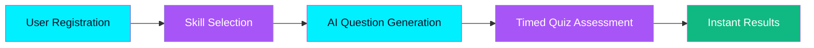
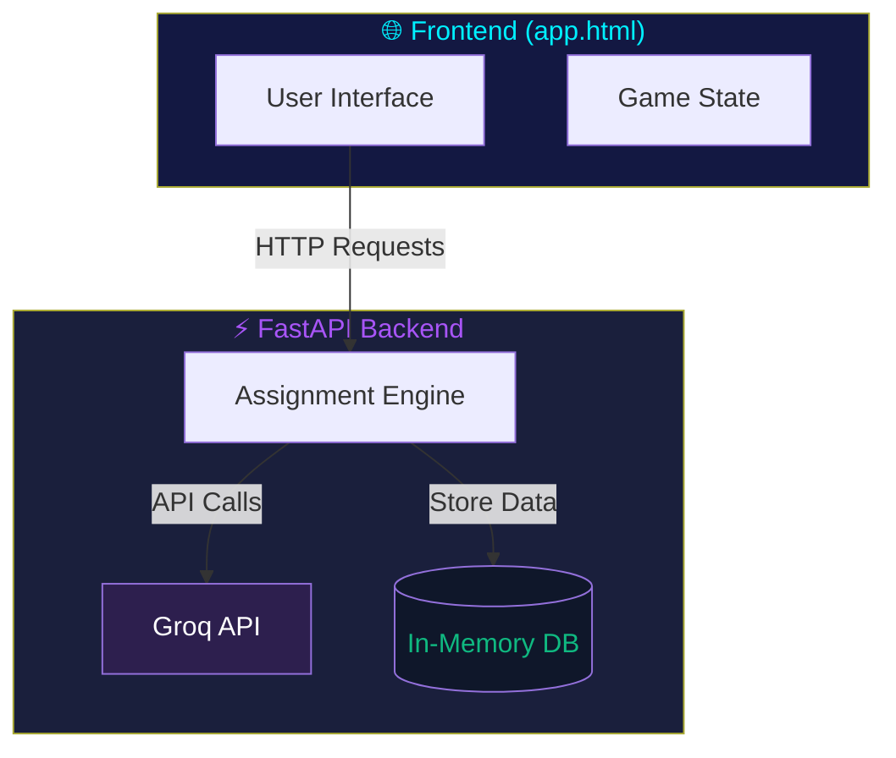
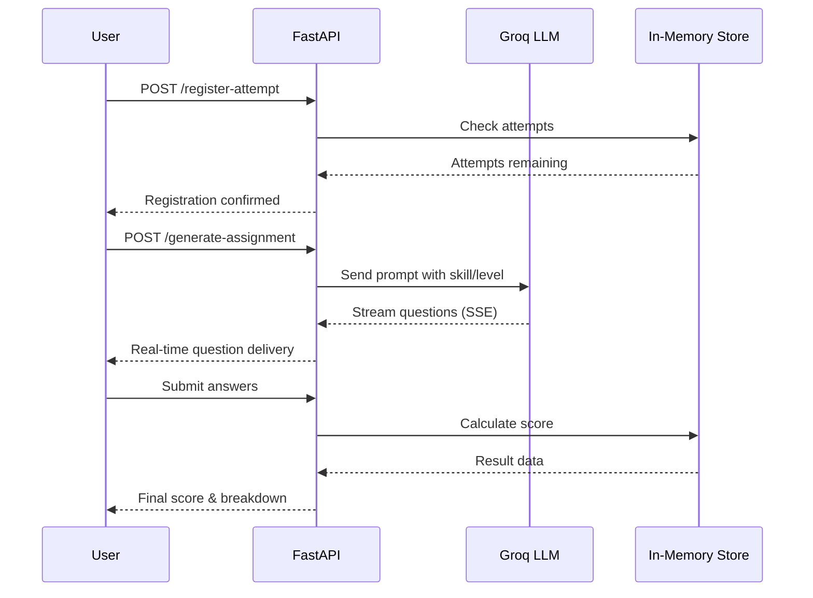

# Skill Achiver - AI-Powered Skill Assessment Platform

<p align="center">
  
  
  
  
  
  <a href="https://github.com/ujjwalkaushik/Skill_Achiver/blob/main/LICENSE"></a>
</p>


> A production-ready AI-powered skill assessment platform that generates challenging technical exams using LLM technology.

---

## Table of Contents

- [Overview](#overview)
- [Live Demo](#-live-demo)
- [Key Features](#key-features)
- [How It Works](#how-it-works)
- [Interactive Architecture](#-interactive-architecture)
- [Supported Skills](#supported-skills)
- [Quick Start](#quick-start)
- [API Endpoints](#api-endpoints)
- [Quiz Structure](#quiz-structure)
- [Environment Variables](#environment-variables)
- [Security Considerations](#security-considerations)
- [Contributing](#contributing)
- [License](#license)

---

## Overview

Skill Achiver is an intelligent assessment platform designed to evaluate technical skills through AI-generated questions. It helps organizations:

- **Automate exam creation** - AI generates relevant questions based on skills and experience level
- **Standardize assessments** - Consistent, high-quality questions for all candidates
- **Save recruiter time** - No manual question bank maintenance needed
- **Identify top talent** - Challenging questions designed to distinguish skilled candidates

---

## 🔴 Live Demo

<p align="center">
<a href="http://localhost:8001/app">
  
</a>
</p>

<p align="center">
  <em>Click above to launch the interactive assessment platform</em>
</p>

---

## Key Features

| Feature | Description | Status |
|---------|-------------|--------|
| **AI-Powered Generation** | Creates custom questions using LLM technology | ✅ Active |
| **50+ Skills Supported** | AWS, Azure, Python, JavaScript, React, Docker, and more | ✅ Active |
| **Real-time Streaming** | Questions appear as they're generated | ✅ Active |
| **Timed Sections** | Structured quiz with time management | ✅ Active |
| **Instant Results** | Immediate scoring and detailed feedback | ✅ Active |
| **Attempt Tracking** | Prevents repeated attempts per skill | ✅ Active |

---

## How It Works



### Step-by-Step Flow

| Step | Process | Description |
|------|---------|-------------|
| **1️⃣** | Register | Enter name, ID, skill, and experience level |
| **2️⃣** | Generate | AI creates 20 custom questions via Groq LLM |
| **3️⃣** | Take Quiz | Answer questions with timed sections |
| **4️⃣** | Results | View score, breakdown, and performance report |

---

## 🔧 Interactive Architecture



### Data Flow



---

## Supported Skills

<details>
<summary><b>Click to expand skill categories</b></summary>

### ☁️ Cloud Platforms
| AWS | Azure | GCP |
|-----|-------|-----|
| AWS EC2 | Azure VM | GCP Compute |
| AWS S3 | Azure Storage | BigQuery |
| AWS Lambda | Azure Functions | Cloud Functions |
| AWS DynamoDB | Azure Cosmos DB | Firestore |

### 💻 Programming Languages
<div style="display:flex;gap:10px;flex-wrap:wrap;">


</div>

### 🎨 Frontend Frameworks
<div style="display:flex;gap:10px;flex-wrap:wrap;">


</div>

### ⚙️ Backend Frameworks
| Django | FastAPI | Express | Spring | Rails |
|--------|---------|---------|--------|-------|
| Python | Python | Node.js | Java | Ruby |

### 🐳 DevOps Tools
<div style="display:flex;gap:10px;flex-wrap:wrap;">


</div>

### 📊 Data & ML
| SQL | NoSQL | Data Science | Machine Learning | Deep Learning |
|-----|-------|--------------|------------------|---------------|
| PostgreSQL | MongoDB | Pandas | TensorFlow | PyTorch |
| MySQL | Redis | NumPy | Keras | Hugging Face |

### 🔐 Security
<div style="display:flex;gap:10px;flex-wrap:wrap;">


</div>

</details>

---

## Quick Start

### Prerequisites

- Python 3.10+
- Groq API Key ([get from console.groq.com](https://console.groq.com))

### Installation

```bash
# Clone the repository
git clone https://github.com/ujjwalkaushik/Skill_Achiver.git
cd Skill_Achiver

# Install dependencies
pip install -r requirements.txt
```

### Configuration

Create a `.env` file in the project root:

```env
GROQ_API_KEY=your_api_key_here
```

### Running

```bash
# Start the server
python main.py
```

Access the web interface at: **http://localhost:8001/app**

---

## API Endpoints

### Interactive API Docs

<p align="center">
<a href="http://localhost:8001/docs">
  
</a>
</p>

| Method | Endpoint | Description | Try it |
|--------|----------|-------------|--------|
| GET | `/app` | Web interface | [Launch](http://localhost:8001/app) |
| GET | `/api/health` | Health check | [Check](http://localhost:8001/api/health) |
| POST | `/generate-assignment` | Generate quiz questions | 📋 See below |
| POST | `/api/check-attempts` | Check remaining attempts | 📋 See below |
| POST | `/api/register-attempt` | Register new attempt | 📋 See below |
| POST | `/api/submit-result` | Submit quiz results | 📋 See below |
| GET | `/api/results/{id}` | Get student results | 📋 See below |

### Example Request

```bash
curl -X POST "http://localhost:8001/generate-assignment" \
  -H "Content-Type: application/json" \
  -d '{
    "student_id": "1234",
    "student_name": "John Doe",
    "skills": ["Python"],
    "exp_level": "3 years",
    "subject": "Python"
  }'
```

---

## Quiz Structure

| Attribute | Value | Visual |
|-----------|-------|--------|
| Total Questions | 20 | █████████████████████ |
| Time Limit | 60 minutes | ⏱️ 60:00 |
| Difficulty | Progressive | Basic → Advanced → Expert |
| Pass Rate Target | 5-10% | 🎯 Elite |

---

## Environment Variables

| Variable | Required | Description | Default |
|----------|----------|-------------|---------|
| `GROQ_API_KEY` | Yes | Your Groq API key | None |

---

## Security Considerations

> ⚠️ **Important**: The following settings are suitable for development/testing only. Before deploying to production, address these items:

- **CORS**: Currently allows all origins - restrict to your domain(s)
- **Storage**: In-memory only - use Redis/PostgreSQL for persistence
- **Rate Limiting**: Not implemented - add per-endpoint rate limits
- **Authentication**: Not implemented - implement user auth system

---

## Contributing

<p align="center">
<a href="https://github.com/ujjwalkaushik/Skill_Achiver/issues">
  
</a>
<a href="https://github.com/ujjwalkaushik/Skill_Achiver/pulls">
  
</a>
</p>

Contributions are welcome! Please feel free to submit a Pull Request.

---

## License

This project is licensed under the [MIT License](LICENSE).

---

<p align="center">
  Built with <a href="https://fastapi.tiangolo.com">FastAPI</a> + <a href="https://groqcloud.com">Groq LLM</a>
</p>

<p align="center">
  
</p>
